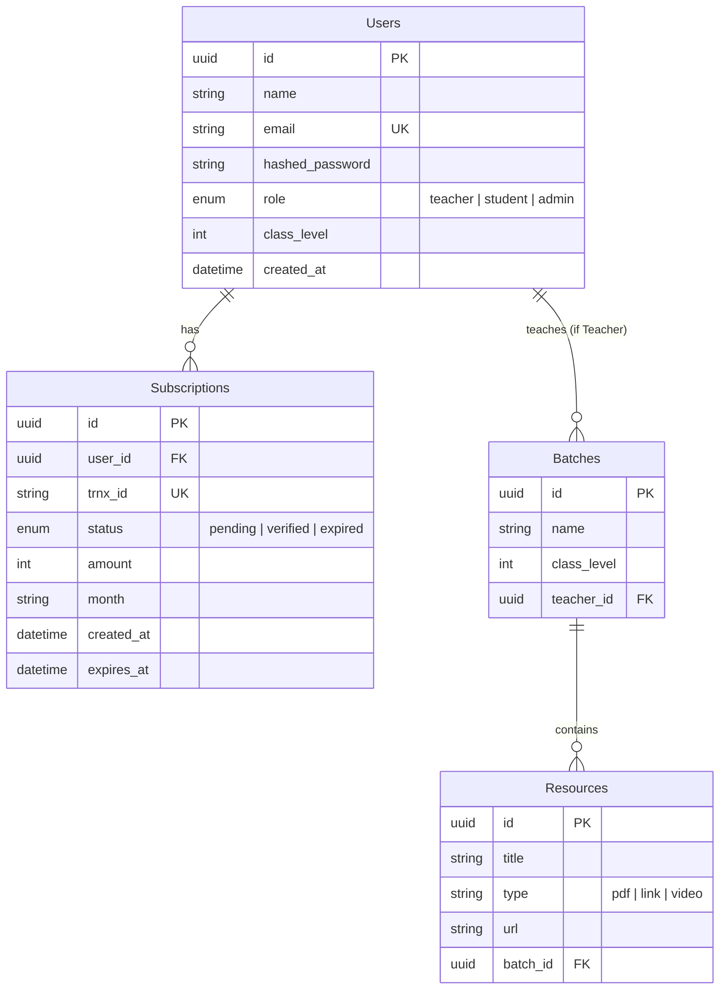

# Saif Academy LMS - English Learning Platform

A full-stack English Learning Management System (LMS) designed for Class 6-12 students in Bangladesh, featuring multi-role authentication, monthly subscription management, and a glassmorphism UI.

## Tech Stack
- **Backend:** FastAPI, SQLAlchemy, PostgreSQL
- **Frontend:** Next.js (App Router), Tailwind CSS v4, DaisyUI
- **Authentication:** JWT (RS256)

## Database Schema (ERD)

## API Endpoints

### Authentication
- `POST /auth/register`: Register as a Student or Teacher.
- `POST /auth/login`: Authenticate and receive a JWT.

### Subscriptions
- `POST /subscriptions/`: Submit a payment (Transaction ID).
- `GET /subscriptions/me`: View my subscription history (Student).
- `GET /subscriptions/pending`: View all pending verifications (Teacher).
- `PATCH /subscriptions/{id}/verify`: Verify a student's payment (Teacher).

### Materials & Classes
- `GET /materials/live-classes`: Access live class links (Requires verified subscription).
- `POST /materials/upload`: Upload new resources or lecture videos (Teacher).

## UI Design
The platform uses a **"Gravity-Defying"** UI theme:
- **Royal Blue & White** color palette.
- **Glassmorphism** (semi-transparent, blurred backgrounds).
- **DaisyUI** components for a clean, consistent look.
